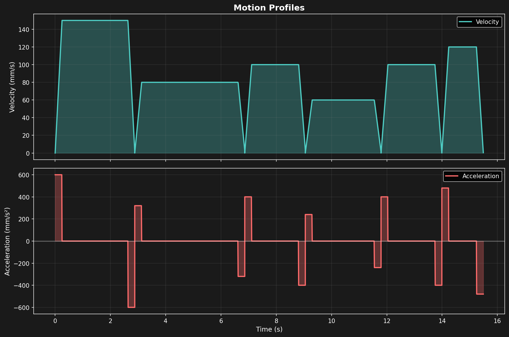
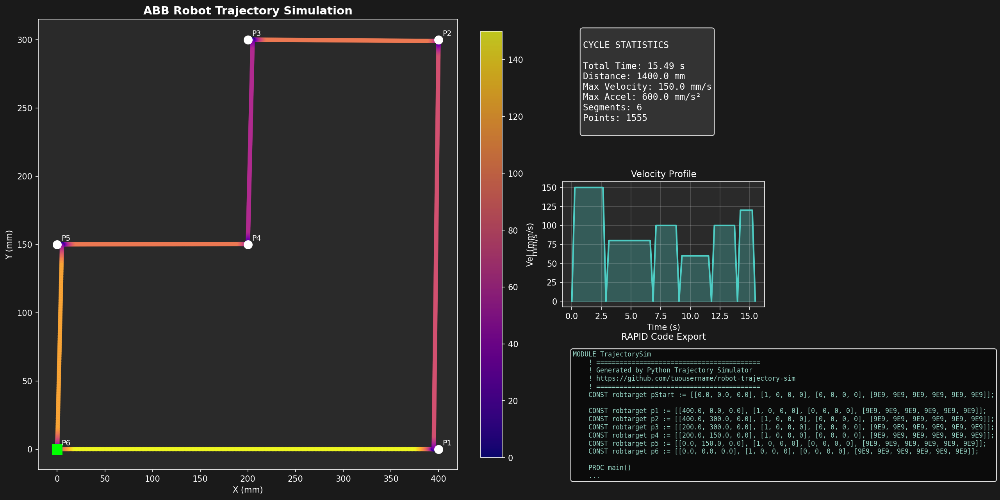

# 🤖 Robot Trajectory Simulator

Simulatore di traiettorie per robot industriali ABB con generazione codice RAPID e analisi cinematica.

## Panoramica

Progetto Python che simula il comportamento reale dei movimenti robot ABB, includendo:
- Profili di moto trapezoidali (accelerazione/velocità/decelerazione reali)
- Gestione zone di precisione (z0, z1, z5, z10, z20, z50, fine)
- Calcolo tempo ciclo accurato
- Esportazione codice RAPID pronto per FlexPendant
- Visualizzazione 2D con heatmap velocità

## Output

| Traiettoria 2D | Profili di moto | Preview progetto |
|:--:|:--:|:--:|
|  |  |  |

## Installazione

```bash
pip install -r requirements.txt
